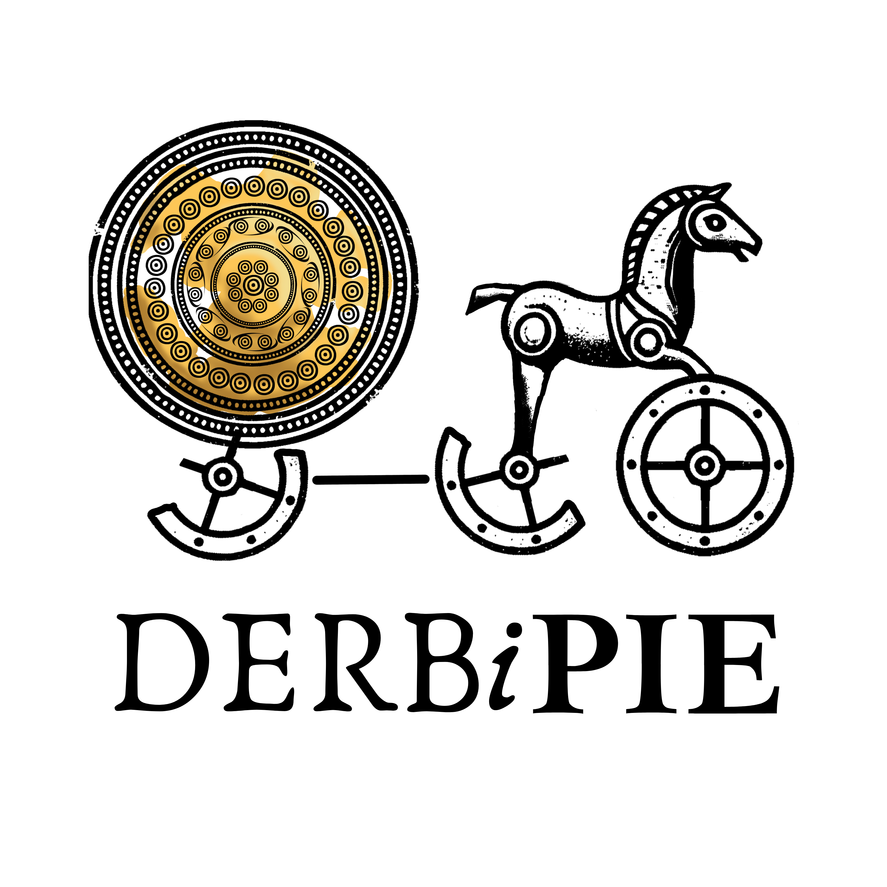

# Pretest

-   What is your background in computing?

-   What would you like to get out of the course?

-   While this isn't anonymous, please answer truthfully!

-   This will help me better understand how to structure the class.

# What is this course?

{fig-align="center" width="60%"}

## In this class, I'm assuming that you ...

-   Know how to use a computer and can access the internet;

-   Know what generative AI is and have used it before.

-   Aren't terribly familiar with the command prompt, and perhaps don't even know what it is;

-   Have never programmed before;

## My Background: I am ...

-   A formally trained historical linguist (Ph.D. 2010, UCLA, Indo-European Studies)

-   Specialist in:

    -   Proto-Indo-European & Ancient IE Languages

    -   Historical Phonology

    -   Constructed Languages

    -   Thinking about old problems in new ways

        -   Syllable structure in PIE

        -   Aspirates & Implosives

        -   Immersive PIE

## My Background: I am NOT ...

-   A formally trained computer scientist

-   A formally trained programmer

-   A formally trained computational linguist

## Wait, then why is [*this guy*]{.underline} teaching me Computation for Linguists?

-   Despite my lack of formal training in programming

    -   Taught self Python, using online courses & resources

    -   Have studied with specialists (like Dr. Fruehwald!) to learn how computational tools can be used in linguistic work

    -   Have managed multiple groups of programmers on a variety of projects

-   All of this to pursue long-held dream to build a vast database, called "DERBi PIE": a Database of Etymological Roots Beginning in Proto-Indo-European

## DERBi PIE

{fig-align="center" width="100%"}

-   Received funding from the NEH in January 2025 (first try, which is wild, given the 6% acceptance rate!)

    -   Funding pulled with the DOGE-pocalypse in April 2025

    -   What to do? Build the damn thing myself, with the help of Gen AI for high-level coding.

## What does that mean for y'all?

-   With me as your teacher:

    -   Given that I recently learned how to program, this means that I perhaps better understand the issues that a beginner might have;

    -   There may be questions you have that I cannot initially answer, but I will find you those answers.

## What does that mean for y'all?

-   For you as my student:

    -   You will gain a solid foundation is the fundamentals of programmings and computational tools used by linguists

    -   It's unlikely that you'll be able to code at a high level; but... you should be able to code at a higher level with the help of Gen AI.

    -   Broadly speaking, you should be able to *understand* the advanced code that you use, though not necessarily have come up with it yourself.

## Does this mean you *have* to use AI?

-   No. You can do all of the assignments and coursework without AI.

-   The class and assignments are just structured assuming that some of you will.

## A Sneak Peek: Real Research, Real AI Help

-   Imagine you're doing a research project and you ask an AI assistant:

::: callout-note
"I'm doing my final project on causative constructions ('make him leave,' 'have her call,' 'let them go') in child-directed vs. adult-directed speech. I have two folders of transcribed English text files — one CDS, one ADS. Can you help me figure out how to compare how often causatives show up in each?"
:::

## A Sneak Peek: Real Research, Real AI Help

-   A good AI assistant doesn't just hand you code — it asks questions and explains tradeoffs first:

::: callout-note
Are you counting only syntactic causatives (make/have/let/get + infinitive), or lexical ones too (like *kill*, *drop*)? Are your corpora balanced in size, or will you need to normalize?

I'd tokenize with spaCy, tag POS, define a trigger-verb list, and check for a base-form verb nearby. Then normalize counts per 1,000 words and compare with a bar chart.

One real limitation: this heuristic will misfire sometimes — pull a sample of matches and hand-check them before you trust the numbers.
:::

## A Sneak Peek: The Mystery Script

-   Here's the script it might hand back:

``` python
import os, glob
import spacy
import pandas as pd
import matplotlib.pyplot as plt

nlp = spacy.load("en_core_web_sm")
CAUSATIVE_VERBS = {"make", "have", "let", "get"}

def find_causatives(doc, window=4):
    """Flags a causative trigger verb if a base-form verb ('VB')
    shows up within `window` tokens afterward."""
    matches = []
    for i, token in enumerate(doc):
        if token.lemma_.lower() in CAUSATIVE_VERBS and token.pos_ == "VERB":
            for wt in doc[i+1 : i+1+window]:
                if wt.tag_ == "VB":
                    matches.append({"trigger": token.lemma_.lower(), "complement": wt.text})
                    break
    return matches

def analyze_corpus(folder_path):
    counts = {v: 0 for v in CAUSATIVE_VERBS}
    total_words = 0
    for filepath in glob.glob(os.path.join(folder_path, "*.txt")):
        with open(filepath, "r", encoding="utf-8") as f:
            doc = nlp(f.read())
        total_words += sum(1 for t in doc if t.is_alpha)
        for match in find_causatives(doc):
            counts[match["trigger"]] += 1
    return counts, total_words

def normalized_freq(counts, total_words, per=1000):
    return {v: (c / total_words) * per if total_words else 0 for v, c in counts.items()}

cds_counts, cds_total = analyze_corpus("child_directed_speech")
ads_counts, ads_total = analyze_corpus("adult_directed_speech")

df = pd.DataFrame({
    "CDS (per 1k words)": normalized_freq(cds_counts, cds_total),
    "ADS (per 1k words)": normalized_freq(ads_counts, ads_total),
})
df.plot(kind="bar", title="Causative Verb Frequency: CDS vs. ADS")
plt.tight_layout()
plt.show()
```

## A Sneak Peek: The Mystery Script

-   Right now, this probably looks like magic — or gibberish!
-   But... by the end of the semester, you'll be able to read every line of this yourself — functions, `spaCy`, `pandas`, visualization — and just as importantly, judge whether the *logic* is actually sound.
-   We'll revisit this code towards the end of the course.

## Why do you need this course?

1.  In Linguistics (academia and the private sector, like Google), working with large amounts of data is standard

    -   Programming provides us with tools to process that data!

2.  There are quite a few annoying parts of Linguistics that require special tools, think:

    -   IPA symbols

    -   Syntax Trees

    -   Leipzig Glossing Rules

3.  Understanding how to use Gen AI as a tool, not as a crutch

## What will you learn in this class?

-   How to think programmatically:

    -   Python

    -   How do linguists use computers to conduct research?

-   How to compile documents in LaTeX

    -   Word and Google docs are not great for many reasons. Let me show you a better way.

-   How to put together a website

    -   Learning the basics of HTML, CSS, and JavaScript, to host your final project

# What specific computational skills will you acquire?

## **GIT SKILLS**

-   Version control basics:

    -   setting up a local Git repository and connecting it to GitHub

    -   core commands: `clone`, `add`, `commit`, `push`, `pull`

    -   pulling that day's class files before each session

-   Using GitHub in this course:

    -   submitting and accessing homework via the course repository

    -   publishing your final project website with GitHub Pages

## **PYTHON SKILLS**

-   Basic programming concepts:

    -   writing scripts

    -   variables

    -   data types

    -   loops

    -   conditionals

    -   functions

    -   importing libraries

## **PYTHON SKILLS**

-   Text and language data processing:

    -   string manipulation

    -   tokenizing text

    -   finding patterns with regex

    -   counting and sorting words

## **PYTHON SKILLS**

-   Data handling with **pandas**:

    -   reading/writing CSV/Excel

    -   filtering

    -   grouping

    -   sorting

    -   merging datasets

    -   calculating descriptive stats

## **PYTHON SKILLS**

-   Computational linguistics tools:

    -   NLTK/spaCy for tokenization

    -   lemmatization

    -   POS tagging

    -   word frequency analysis

    -   WordNet for semantic relations

    -   working with non-English text data

## **PYTHON SKILLS**

-   Automation and reproducibility:

    -   writing scripts to process multiple files

    -   using loops for batch processing

    -   writing reusable functions for repeated tasks

    -   exporting processed results

## **VSCode SKILLS**

-   Reproducible reporting in **VSCode**:

    -   writing code and commentary in **Quarto** documents;

    -   generating HTML/PDF slides and reports;

    -   combining code, prose, and output in a single reproducible file.

## **LaTeX SKILLS**

-   Structuring a document: sections, lists, formatting

-   Typesetting linguistic content: IPA symbols, syntax trees, interlinear glosses (Leipzig Glossing Rules)

-   Managing citations and bibliographies

-   Compiling with Overleaf

# What you'll need for this course

-   A **computer**, preferably a laptop for in-class computation. OS can be PC, Mac or Linux.

-   Access to the Internet

## What you'll need for this course

-   Chosen IDE for class: [**VSCode**](https://code.visualstudio.com/download)

    -   IDE = "Integrated Development Enivornment", required tool for software development

    -   After we install it, run VSCode on your laptop each and every class

## What you'll need for this course

-   LaTeX Compiler: [**Overleaf**](https://www.overleaf.com/)

    -   You *can* use a local LaTeX compiler, but Overleaf makes packages ***much*** simpler. I've never looked back after I switched to it.

## What you'll need for this course

-   Git Repository: [**GitHub**](https://github.com/)

    -   With this you'll learn how to upload and manage your software

    -   You'll also create a webpage to promote yourself and your work.

# Grades

**Classwork (based on attendance):** 25%

**Homework:** 45% (9 total - 5% each)

<ol style="font-size: 0.6em; line-height: 1.2;">

<li>HW 1 – The Command Prompt</li>

<li>HW 2 – Beginning Python</li>

<li>HW 3 – Loops & Conditionals</li>

<li>HW 4 – LaTeX</li>

<li>HW 5 – Pandas-monium</li>

<li>HW 6 – Functions</li>

<li>HW 7 – Semantic Analysis</li>

<li>HW 8 – LaTeX</li>

<li>HW 9 – Building Your Website</li>

</ol>

## Grades

**Final Project:** 30% (5 Components)

<ol style="font-size: 0.6em; line-height: 1.2;">

<li>Choose Dataset & Type of Analysis – 5%</li>

<li>Cleaning & Processing of Data – 5%</li>

<li>Preliminary Analysis – 5%</li>

<li>Peer Feedback – 5%</li>

<li>Final Presentation & Report – 10%</li>

</ol>

# Course Policies

-   **Attendance:** tracked via the Canvas Attendance tool — you get **3 free absences**, no questions asked. Beyond that, additional absences may affect your Classwork grade unless excused.

-   **Late work:** homework & project components lose **2% per day late** (capped at 20% off); still accepted for 80% credit after 10 days late.

## Course Policies

-   **AI Policy (the actual rules):** permitted for debugging error messages, explaining a concept, and assisting with your Final Project (Components 1–5) — **not** permitted for generating Homework 1–9 solutions from scratch. Any AI use must be cited (a quick note on where/how you used it).

-   **Accommodations:** need support for a diagnosed disability or mental health condition? Reach out to the Disability Resource Center (DRC) any time.

# Questions?

# Activity: Learning How to Think Like a Computer

## Learning How to Think Like a Computer

-   Consider the meaning of the following sentences:

1.  *It's noisy in here.*

2.  *I'm starving.*

3.  *I have a car.*

## Learning How to Think Like a Computer

-   Now, with your neighbors, consider how meaning of these sentences changes in different contexts:

1.  *It's noisy in here.* (Statement directed towards friend when going inside a crowded room.)

2.  *I'm starving.* (Statement directed towards friend at 2 pm.)

3.  *I have a car.* (Statement directed towards friend in response to "How are you getting to the party?")

## Learning How to Think Like a Computer

-   How would a computer interpret these sentences?

1.  It's noisy in here. (Statement directed towards friend when going inside a crowded room.)

2.  I'm starving. (Statement directed towards friend at 2 pm.)

3.  I have a car. (Statement directed towards friend in response to "How are you getting to the party?")

## Activity: Make Me a Sandwich!

**Goal:** Write instructions that a computer could follow *without guessing* or filling in missing steps.

1.  Form groups of three.

2.  Your task: write step-by-step instructions for making a peanut butter & jelly sandwich for Dr. Byrd.

3.  Be **explicit** — if a step isn't written, it doesn't happen.

4.  Remember: A computer will follow your instructions **literally**.

## Activity: Make Me a Sandwich!

**Challenge:**

-   The group with the fewest steps *that still results in a correct sandwich* wins.

-   If your instructions are too short and leave gaps, the "computer" (i.e., Dr. Byrd) will execute them in unexpected ways!

# Before Next Time

## Check Canvas Tonight

-   I'm sending you a Canvas message with install instructions for **VSCode** and **Git**

-   Follow it the same way we just talked about — explicitly, step by step, don't assume something happened if you didn't do it

-   Should take about 15 minutes

-   Stuck? Don't fight it for an hour — note where you got stuck and email me. We'll fix it together on Wednesday, which is a workshop day for exactly this.

<!--# To change for next time:  pare down the list of skills learned in the class (some overlap, but also just too much for first day); activity was fantastic, one group combined the PB & J into a single squeeze packet, another just opened an uncrustable. This led to discussion about importing packages to save work/steps. -->

<!--# 2026 restructure note: IDE swapped RStudio -> VSCode throughout. HW list reordered to match new unit sequence (command line -> python -> loops -> pandas -> LaTeX -> spaCy -> functions/viz -> website). "What will you learn" section reordered to lead with Python instead of LaTeX. -->

<!--# 2026 revisit (skills content): R fully dropped -- course is Python-only now, viz moved to matplotlib in week 6 -- so cut both R SKILLS slides and the Python+R integration slide, removed R mentions from "what you'll learn" and VSCode skills. Added WordNet & non-English data to computational-linguistics skills list; expanded website bullet to HTML/CSS/JS to match week 15. This also addresses the "pare down skills, too much for first day" note above -- list is shorter now. -->

<!--# 2026-08-19: added "Course Policies" section (attendance, late work, AI policy, DRC accommodations) pulled from the updated syllabus, before Questions? -->

<!--# 2026-08-20: fixed causative terminology in AI-demo callout (make/have/let/get + infinitive = syntactic/periphrastic causatives, not lexical -- lexical causatives are single verbs like kill/drop). Added "writing reusable functions for repeated tasks" to the Automation and reproducibility bullets. Added a LaTeX SKILLS slide to match the Python/VSCode skills slides -- content pulled from the IPA/syntax trees/Leipzig glossing "annoying parts of linguistics" bullet earlier in the deck; review wording before this goes out. Removed the cloud-based IDE (trinket.io/GitHub Codespaces) bullet from the VSCode slide -- students should install VSCode locally ASAP instead. -->

<!--# 2026-08-20 (2): rebuilt Grades slide to match syllabus_301.md, which had drifted -- swapped "In-Class Brain Dumps" (30%, no longer exists per syllabus) for "Classwork (based on attendance)" (25%); updated Homework from 8 items/40% (didn't even add up) to the syllabus's actual 9 assignments/45% (5% each), pulling titles from the Tentative Schedule table; filled in Final Project from 1 of 4 stated components to all 5 from the syllabus's Grade Breakdown table (5/5/5/5/10%), removing the old TODO. -->

<!--# 2026-08-20 (3): added a GIT SKILLS slide (first in the "specific computational skills" section, ahead of Python, matching week-1 teaching order) -- covers local repo setup, core commands, pulling class files, and using GitHub for homework submission + GitHub Pages for the final website. -->