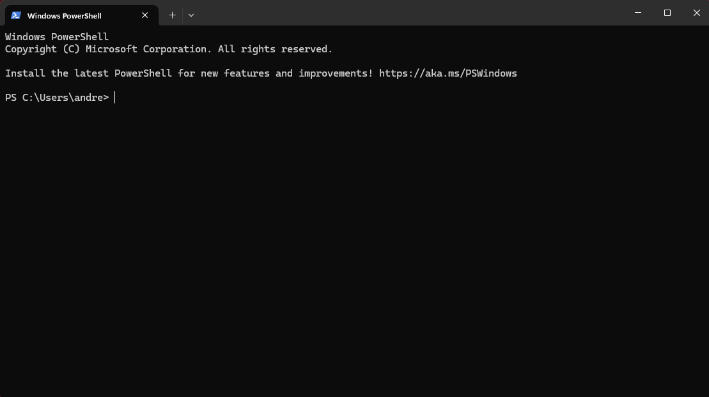
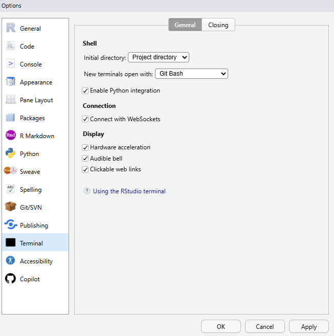

# Review

## Review: So far, you have learned about...

-   **File structure & dependencies**

    -   Setting up VSCode and Git, and why your folders need to be organized consistently
    -   How Git tracks every file in your repo — which only works if you know where things live

## Review: So far, you have learned about...

-   **Commands as instructions**
    -   Git commands (`git commit`, `git push`) are precise instructions with their own syntax
    -   You've already run a few in the terminal without necessarily calling it that

## Review: So far, you have learned about...

-   **Reproducibility & automation**
    -   Git gives you a full history of every change — you can always get back to a working version
    -   This week, the terminal will let you automate the same kind of repetitive file tasks

## This week:

{fig-alt="An Picture of Windows \"Powershell\", a Unix-style Terminal"}

## You may be thinking:

-   Nooooooooooooooooooooooooooooo!
-   I'm still scarred from installing GitHub.
-   Please let's not go back there.

## But:

-   It's important to understand how the basics work.
    -   Where do files live?
    -   How do we navigate between them?
-   And the above concepts - file structure & dependencies, commands, and reproducibility - will be present here, too.

# Learning the Terminal

## Why start in the terminal?

-   Python always runs **inside a folder** (your working directory).
-   If you can move, list, and fetch files here, this will make it easier to understand how to access files in Python later.
-   Same skills for Git and other computational environments, like:
    -   servers and clients
    -   clusters (computers set up to work together)

## Why start in the terminal?

-   While this isn't the case for me, I've been assured by various linguists that understanding how the Terminal works is crucial for conducting certain types of research, particularly in Phonetics

## Navigating the Terminal

-   We'll be working within the integrated `Terminal` in VSCode (View → Terminal)

::: {style="text-align: center;"}
{width="50%"}
:::

## Navigating the Terminal

-   Let's start with the first command

``` bash
pwd         # short for "print working directory"
```

## Navigating the Terminal

-   You can also look to see what's in the current directory

``` bash
ls           # short for "listing files"
```

## Navigating the Terminal

-   Most commands have **options**

``` bash
ls -l        # details (permissions, size, dates)
ls -a        # include hidden files (like .git)
```

## Navigating the Terminal

``` bash
cd          # short for "change directory"
```

-   You need to specify which directory to change into
-   For now, use:

``` bash
cd ~         
```

## Navigating the Terminal

-   Type:

``` bash
ls        
```

-   Find a directory (dir_name) within it, and type (replacing `dir_name` with the actual directory name):

``` bash
cd dir_name        
```

-   This should move you "up" into the directory. Verify this is the case with `ls`.

## Navigating the Terminal

``` bash
cd projects           # into a folder
cd ..                 # up one
cd ~                  # to home
cd ~/Desktop          # absolute path to Desktop\
cd "My Folder"        # if there are any spaces in your named folder
```

## Activity

1.  Type `cd ~`, to bring you to your home directory
2.  Using `pwd` and `ls` as your guide, navigate your way into your `LIN_301` folder

# Making and Renaming Files & Folders

## `mkdir`

-   You should now be in your LIN_301 folder in the Terminal Prompt
-   Look in the Explorer panel (left sidebar) in VSCode, what do you see?
-   Type the following code:

``` bash
mkdir test_folder     # short for "make directory"
```

-   Now look in the right corner - did anything change?

## `rmdir`

-   Now type the following code

``` bash
rmdir test_folder    # short for "remove directory"
```

-   Look in the Explorer panel in VSCode - did anything change?

## `touch`

-   Now type the following code:

``` bash
mkdir test_bolder
touch test_doc.txt
```

-   Look in the Explorer panel in VSCode - did anything change?
-   What does `touch` do?

## `mv`

-   We want to place our new `txt` file in the folder, so let's run this code:

``` bash
mv test_doc.txt test_bolder/    # short for "move"
```

## `mv`

-   Ah crap, I misspelled `test_bolder`, let's run this code:

``` bash
mv test_bolder test_folder    # how you rename in bash
```

## Activity

-   Within your `LIN_301` repo:
    -   Create a file called `activity.txt`
    -   Create the following folders: `folder_1` \> `folder_2` \> `folder_3`
    -   Move `activity.txt` inside `folder_3`
-   You can *only* use the integrated Terminal in VSCode!
    -   Use `pwd` and `ls` as your guide

# A Couple More Tricks

## `curl`

-   We all know how to download things from the Internet, but what about using the Terminal?
-   Type this code:

``` bash
curl -o term_comm.txt https://winjapati.github.io/301_Fall_2025/3_command_line/12_term_comm.txt#
```

-   This is a useful list of Terminal commands
-   Move this file into `folder_1`

## `rm -r`

-   Let's learn one more bash command

``` bash
rm -r folder_1
```

-   What happens?

## You bastard!

-   Don't worry! Type the following code:

``` bash
touch script.sh 
```

## Bringing it Back

-   Now copy and paste (use right click) into the Terminal:

``` bash
cat > script.sh <<'EOF'     
#!/bin/bash                 
echo "This is my first script."
curl -o term_comm.txt https://winjapati.github.io/301_Fall_2025/3_command_line/12_term_comm.txt#
mkdir folder_1
mv term_comm.txt folder_1
echo term_comm.txt
```

-   Then type:

``` bash
EOF
```

-   Look inside `script.sh`, what did you do?

## OMG

-   Type:

``` bash
source script.sh
```

<!-- Day 1: Navigating the Terminal -->

<!-- -   changing directories in the terminal, going up, going down, going to specific location -->

<!-- -   downloading files using "curl" -->

<!-- -   creating a file, deleting a file -->

<!-- -   creating a folder, deleting a folder -->

<!-- -   writing a .sh script -->

<!-- -   activity, integrating all of this -->
